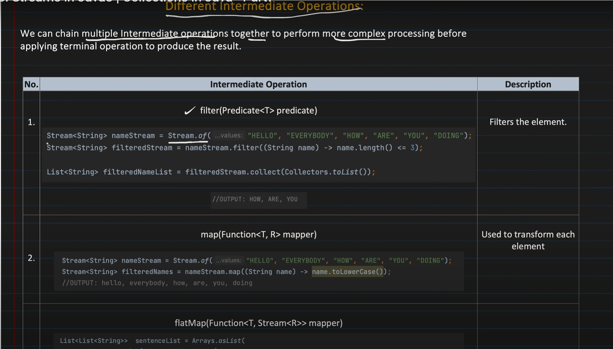
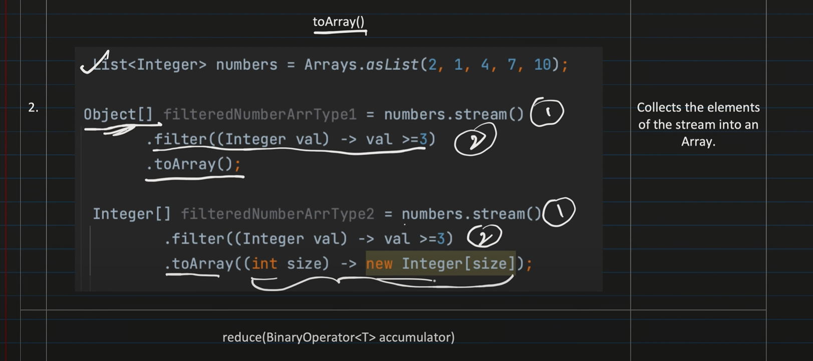
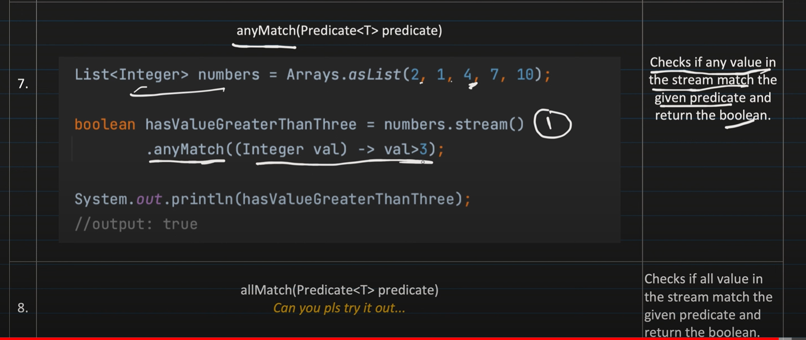
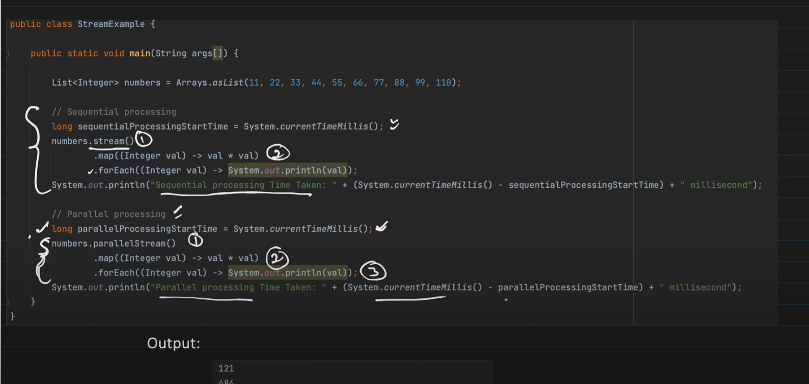

### What is Stream?
- We can consider Stream as a pipeline, through which our collection elements passes through.
- While elements passes through pipelines, it performs various operations like sorting, filtering etc.
- Useful when deals with bulk processing. (can do parallel processing)

[//]: # ()